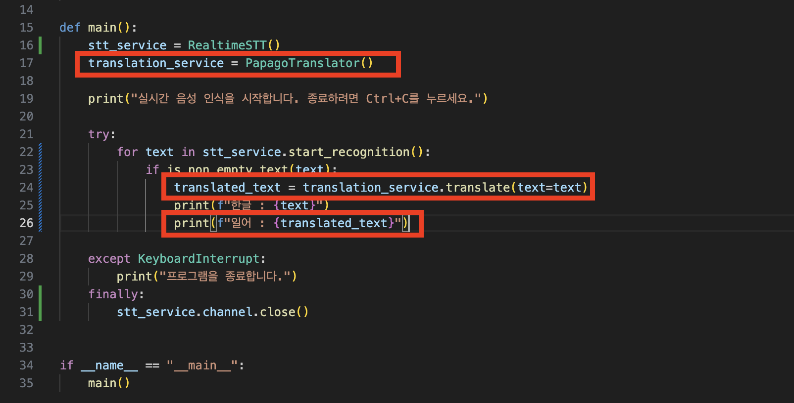

# 클로바 STT를 사용한 실시간 번역
Clova Speech의 실시간 음성인식과 Papago API를 활용한 실시간 한-일 번역 프로그램 입니다.  
STT만 필요할 경우 `src/main.py` 파일을 아래 사진과 같이 빨간색 박스 부분을 주석처리하여 사용합니다.  


<br>

# 실행 방법
```bash
## 가상 환경 만들기
python3 -m venv .venv

## 가상 환경 실행
# MAC / Linux
. .venv/bin/activate
# Windows
. .venv/Script/activate

## for mac
# MAC은 pyaudio 설치 전 portaudio 설치가 필요합니다.
brew install portaudio

## 의존성 설치
pip install -r requirements.txt
pip install pyaudio
pip install grpcio
pip install --upgrade google-api-python-client


## 환경변수 입력
export CLOVA_API_KEY="<CLOVA_API_KEY>"
export PAPAGO_CLIENT_ID="<PAPAGO_CLIENT_ID>"
export PAPAGO_CLIENT_SECRET="<PAPAGO_CLIENT_SECRET>"

# 실행
python __main__.py
```